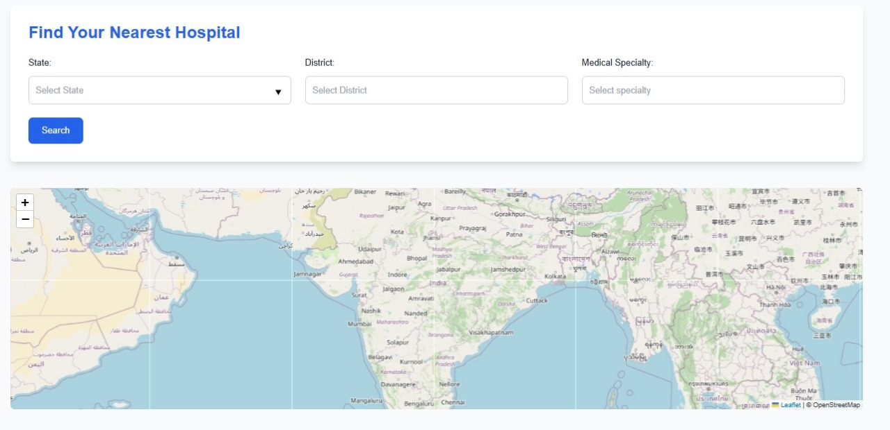
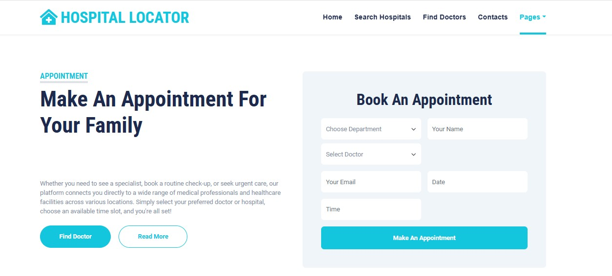
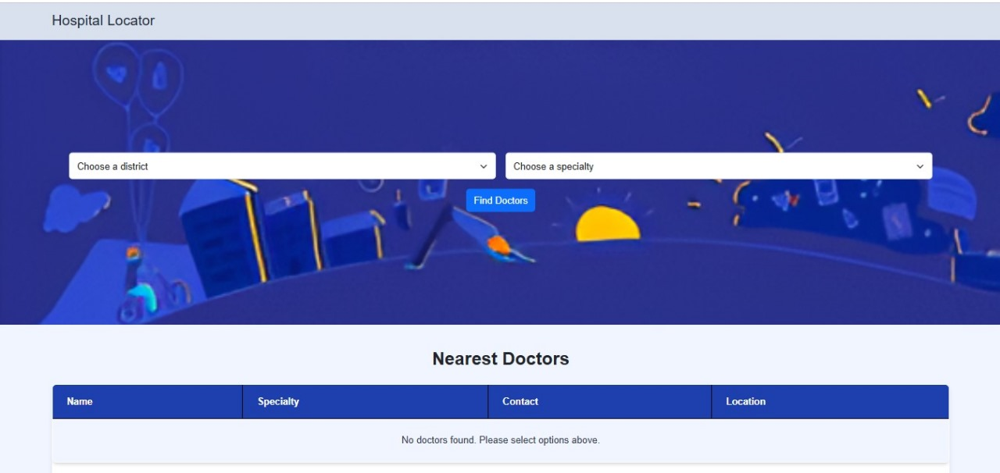

# Hospital Locator 🚑  

## Table of Contents  
- [Introduction](#introduction)  
- [Features](#features)  
- [Technologies Used](#technologies-used)  
- [Screenshots](#screenshots)  
- [Database Setup](#database-setup)  
- [Steps to Run the Project](#steps-to-run-the-project)  
- [Contributing](#contributing)  
- [License](#license)  


---

## Introduction  
The **Hospital Locator** is a web application designed to assist users in locating nearby hospitals, finding doctors based on specialization, and managing appointments. The project also includes a secure user authentication system and a contact us page for inquiries.  


---


## Features

| Feature               | Description                                     |  
|-----------------------|-------------------------------------------------|  
| User Authentication   | Sign up and log in functionality for users.     |  
| Search Nearby Hospitals | Locate hospitals based on the user's location.|  
| Find Doctors          | Search for doctors by specialization.           |  
| Appointment Booking   | Book, view, and cancel appointments.            |  
| Contact Us            | Submit queries to the admin for assistance.     |  
  

---

## Technologies Used  
 
  
  
  
  
  

---
## Installation  
1. Clone this repository:  
   ```bash
   git clone https://github.com/Himanshu-oss-cmyk/hospital-locator.git
   ```
2. Navigate to the project directory:  
   ```bash
   cd hospital-locator
3. **Ensure you have XAMPP installed on your system.**  
   - Download XAMPP from [Apache Friends](https://www.apachefriends.org/).  
   - Install and start **Apache** and **MySQL** from the XAMPP Control Panel.  

4. **Move the project folder to the XAMPP `htdocs` directory:**  
   - Locate your XAMPP installation folder (e.g., `C:\xampp\htdocs`).  
   - Copy the `hospital-locator` project folder into the `htdocs` directory.  

5. **Import the database:**  
   - Open **phpMyAdmin** in your browser by navigating to `http://localhost/phpmyadmin`.  
   - Create a new database:  
     ```sql
     CREATE DATABASE hospital_locator;
     ```  
   - Import the provided SQL file into this database:  
     - Click on the `hospital_locator` database.  
     - Select the **Import** tab.  
     - Choose the SQL file (e.g., `hospital_locator.sql`) from the project directory.  
     - Click **Go** to import.  

6. **Run the project:**  
   - Open your browser and type:  
     ```  
     http://localhost/hospital-locator  
     ```  
   - The project homepage will load.  
   ```

  ---
## Screenshots  

### Homepage  
  

### Search for Hospitals  
  

### Appointment Booking  
  

### Search for Doctors 
  

  

---

## Project Goals  
- Simplify the process of finding healthcare services.  
- Provide users with a seamless way to book appointments.  
- Leverage technology to improve healthcare accessibility.  
---
